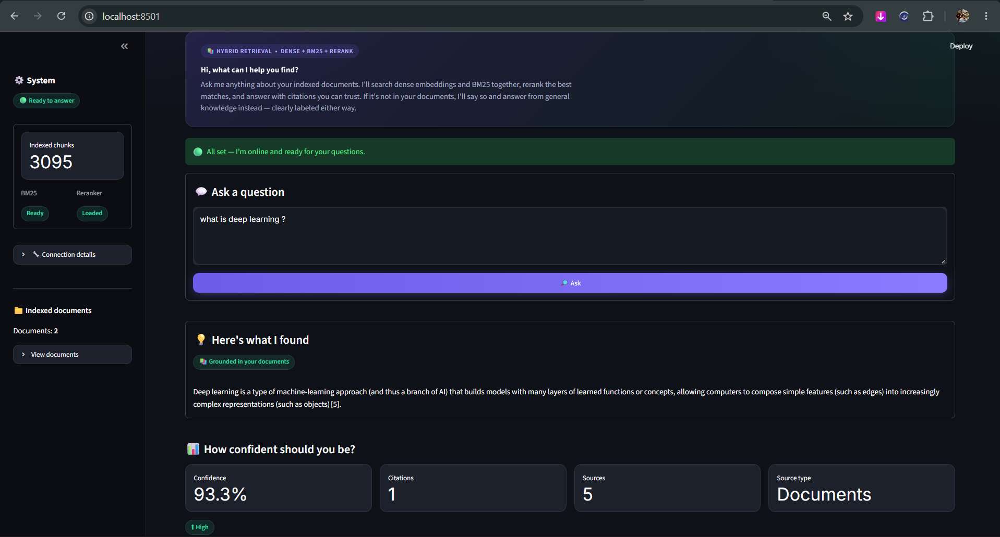
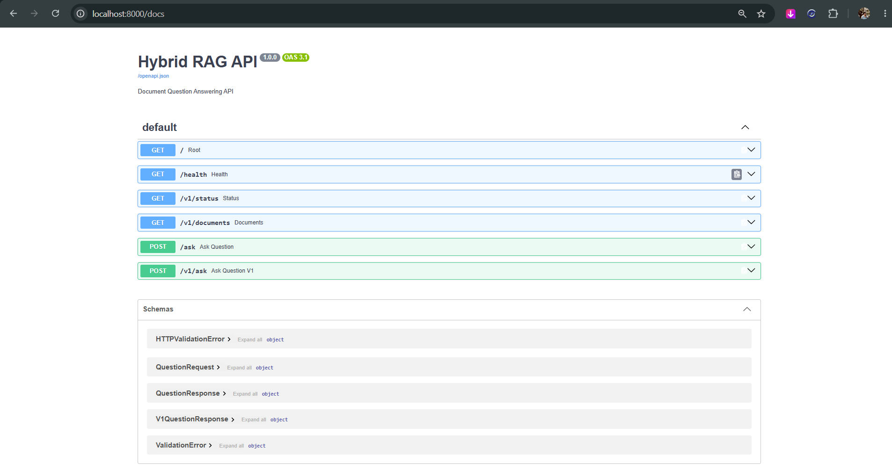

<div align="center">

# ⚡ RAG Pipeline with Hybrid Search Over Internal Docs

**Hybrid Retrieval • RAG • FastAPI • Streamlit • Groq • Docker**

An end-to-end Retrieval-Augmented Generation application combining semantic
vector search, BM25 keyword retrieval, Reciprocal Rank Fusion (RRF),
confidence scoring, and Groq-powered LLM generation for grounded document
question answering.


</div>

---

## 📌 Overview

**RAG Pipeline with Hybrid Search Over Internal Docs** is a document
question-answering system designed to improve retrieval quality by combining:

- Semantic vector search
- BM25 keyword retrieval
- Reciprocal Rank Fusion (RRF)
- Retrieval and evidence confidence scoring
- Groq LLM inference
- FastAPI REST services
- Streamlit interactive UI
- Docker Compose multi-service deployment

The core workflow is:

> Retrieve relevant evidence first, then generate an answer grounded in that evidence.

---

## ✨ Features

- **Hybrid retrieval** — dense embedding search + BM25 keyword search, fused
  with Reciprocal Rank Fusion (RRF)
- **Cross-encoder reranking** — reorders retrieved chunks for relevance before
  they reach the LLM
- **Groq-powered generation** — fast LLM inference for the final answer
- **General knowledge fallback** — if the answer isn't in your documents, the
  assistant clearly labels the answer as general knowledge instead of forcing
  a document citation
- **Citation verification** — checks that each citation in the answer is
  actually supported by the retrieved source text
- **FastAPI backend** — versioned REST API (`/v1/ask`, `/v1/status`,
  `/v1/documents`) with a legacy `/ask` endpoint for backward compatibility
- **Streamlit dashboard** — a dark-themed, interactive UI to ask questions,
  inspect retrieval quality, and browse indexed documents
- **Dockerized** — the API, dashboard, and vector database run together via
  Docker Compose

---

## 🏗️ Architecture

```
        Streamlit Dashboard (8501)
                  │  POST /v1/ask
                  ▼
        FastAPI Backend (8000)
                  │
                  ▼
        Hybrid RAG Pipeline
                  │
      ┌───────────┼───────────┐
      ▼           ▼           ▼
   Dense       BM25        RRF Fusion
   (Chroma)  (rank_bm25)   (hybrid rank)
      └───────────┴───────────┘
                  │
                  ▼
        Cross-Encoder Reranker
        (ms-marco-MiniLM-L-6-v2)
                  │
                  ▼
        Context + Prompt Construction
                  │
        ┌─────────┴─────────┐
        ▼                   ▼
  High confidence      Low confidence
  → Grounded answer    → General knowledge
    + citations           (no fake citations)
        └─────────┬─────────┘
                  ▼
              Groq LLM
          (answer generation)
                  │
                  ▼
        Citation Verification
        + Confidence Scoring
                  │
                  ▼
        Structured API Response
        (answer, grounded, answer_source,
         citations, sources, confidence)
                  │
                  ▼
        Streamlit Dashboard
        📚 Documents · 🌐 General Knowledge
        · Citations · Confidence
```

---

## 📁 Project structure

```
RAG-Hybrid-Search/
├── dashboard/
│   ├── app.py                    # Streamlit UI
│   ├── Dockerfile
│   └── .streamlit/
│       └── config.toml           # dashboard theme
├── data/
│   ├── raw/                       # source PDFs
│   ├── chunks/                    # chunked document data
│   └── chroma/                    # persisted Chroma vector DB
├── src/
│   ├── api/
│   │   └── main.py                 # FastAPI app + endpoints
│   ├── chunking/
│   │   └── chunker.py
│   ├── embeddings/
│   │   └── embedding.py
│   ├── evaluation/
│   │   ├── evaluate_rag.py
│   │   └── evaluate_retrieval.py
│   ├── generation/
│   │   ├── rag_pipeline.py         # core RAG orchestration
│   │   └── groq_llm.py             # Groq API wrapper
│   ├── ingestion/
│   │   └── pdf_loader.py
│   └── retrieval/
│       ├── bm25_retriever.py
│       ├── dense_retriever.py
│       ├── hybrid_retriever.py
│       ├── index_documents.py
│       ├── reranker.py
│       └── vector_store.py
├── tests/
│   ├── test_api.py
│   ├── test_chunking.py
│   └── test_embeddings.py
├── test_chroma.py
├── docker-compose.yml
├── Dockerfile
├── requirements.txt
├── .dockerignore
├── .gitignore
├── .env
└── README.md
```

---

## 🚀 Getting started

### Prerequisites

- [Docker](https://docs.docker.com/get-docker/) and Docker Compose
- A [Groq API key](https://console.groq.com/)

### 1. Clone the repo

```bash
git clone https://github.com/Sreyas2255/RAG-Hybrid-Search.git
cd RAG-Hybrid-Search
```

### 2. Configure environment variables

Create a `.env` file in the project root:

```env
GROQ_API_KEY=your_groq_api_key_here
```

> Add any other environment variables your setup needs (embedding model name,
> Chroma persistence path, etc.) — see `.env.example` if provided.

### 3. Build and run with Docker Compose

```bash
docker-compose up -d --build
```

This starts:
- the FastAPI backend (RAG pipeline + BM25 index + reranker)
- the Streamlit dashboard
- the Chroma vector database

### 4. Open the dashboard

Visit **http://localhost:8501** in your browser.

The FastAPI docs (Swagger UI) are available at **http://localhost:8000/docs**.

---

## 🔌 API reference

| Method | Endpoint         | Description                                   |
|--------|------------------|------------------------------------------------|
| GET    | `/health`        | Health check                                   |
| GET    | `/v1/status`     | Pipeline readiness (BM25, reranker status)      |
| GET    | `/v1/documents`  | List indexed documents and chunk counts         |
| POST   | `/v1/ask`        | Ask a question, get a structured answer with citations, confidence, and sources |
| POST   | `/ask`           | Legacy endpoint — returns just `question` + `answer` |

Example request:

```bash
curl -X POST http://localhost:8000/v1/ask \
  -H "Content-Type: application/json" \
  -d '{"question": "What is deep learning?"}'
```

---

## 📸 Screenshots

**Streamlit dashboard** — ask a question, get a grounded answer with citations and confidence scoring:



**FastAPI interactive docs** (`/docs`) — explore and test every endpoint:



---

## 🗺️ Roadmap

- [ ] Add more document format support beyond PDF
- [ ] Expand evaluation suite for retrieval quality
- [ ] Add authentication for the dashboard

---

## 🙌 Acknowledgments

Built with [Streamlit](https://streamlit.io/), [FastAPI](https://fastapi.tiangolo.com/),
[Chroma](https://www.trychroma.com/), and [Groq](https://groq.com/).
